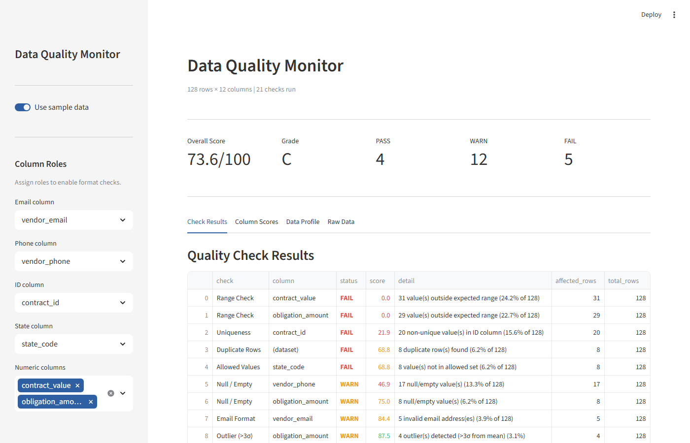
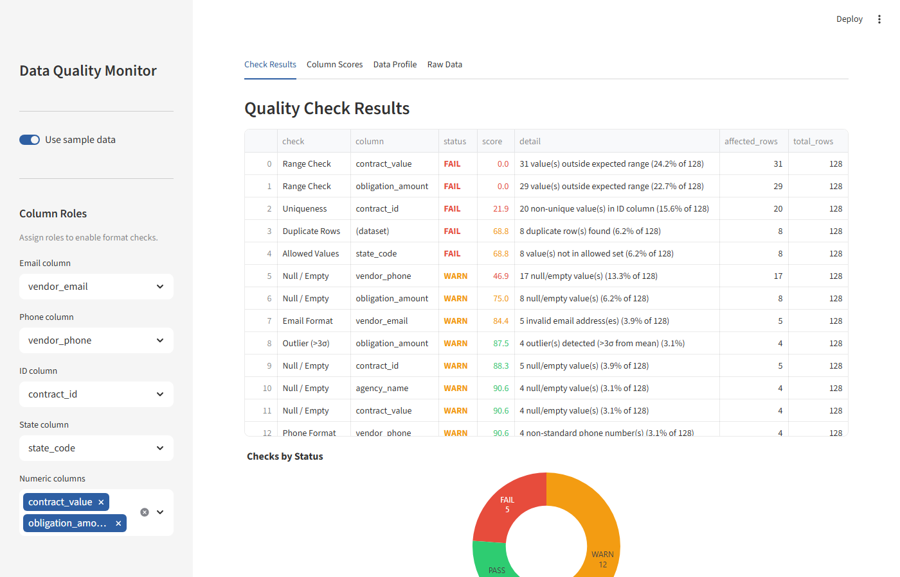
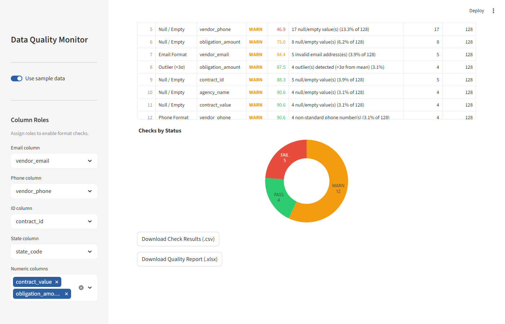

# Data Quality Monitor


An automated data quality assessment tool for government reporting datasets. Profiles any CSV, runs eight configurable quality checks, scores each column and the overall dataset on a 0–100 scale, and exports an audit-ready report.

---

## Business Problem

Government procurement data submitted to FPDS-NG and financial reporting systems is routinely rejected or flagged for data quality failures: duplicate contract IDs, null obligation amounts, invalid state codes, malformed vendor contact information, and out-of-range contract values. Manual QA in Excel misses statistical issues like outliers and cannot be run consistently across submissions.

This tool applies a systematic, repeatable quality check process before data reaches reporting systems — surfacing issues with a scored, auditable report that can be attached to submission documentation or reviewed by a data steward.

---

## Solution Approach

1. **Profile** — `profiler.py` analyzes each column independently: null rate, uniqueness, inferred type (numeric, date, email, phone, categorical, text), and min/max/mean/std for numeric columns
2. **Check** — `checks.py` applies eight rule-based check functions based on the column roles configured in the sidebar
3. **Score** — `scorer.py` computes a weighted composite quality score (0–100) and maps it to a letter grade (A–F)
4. **Report** — Results are displayed across four tabs and exported as CSV or audit-ready Excel

The input data is never modified. All checks are read-only.

---

## Key Features

| Feature | Description |
|---|---|
| Eight configurable quality checks | Null/empty, duplicate rows, uniqueness, email format, phone format, allowed values, outlier detection, range validation |
| Weighted composite score | Per-check scores aggregated to a 0–100 dataset score with severity-weighted check priorities |
| Letter grade with thresholds | A–F grade scale with PASS / WARN / FAIL per check at configurable percentage thresholds |
| Statistical column profiling | Null rate, uniqueness, type inference (numeric/date/email/phone/categorical/text), min/max/mean/std per column |
| Role-based check assignment | Sidebar assigns column roles (ID, email, phone, state, numeric); only relevant checks run per role |
| Audit-ready export | Two-format export: flat CSV for downstream processing; Excel with Summary + Check Results sheets |
| Read-only processing | Input data is never modified — all scoring and profiling is non-destructive |
| Reproducible sample data | 128-row synthetic procurement dataset with injected quality issues; regenerated from `random.seed(99)` |

---

## Skills Demonstrated

| Skill | Implementation |
|---|---|
| Rule-engine architecture | `checks.py` — 8 check functions each returning `list[dict]`; `run_all_checks()` orchestrates conditionally based on assigned column roles |
| Weighted composite scoring | `scorer.py` — `Σ(check_score × weight) / Σ(weights)`; severity-weighted CHECK_WEIGHTS dict |
| Z-score outlier detection | `checks.py` `check_outliers()` — `z = (series - mean) / std; abs(z) > 3.0` |
| Statistical column profiling | `profiler.py` `profile_column()` — null rate, uniqueness, type inference, min/max/mean/std |
| Inferred type detection | `profiler.py` `_infer_type()` — priority-ordered rules: numeric → date → email → phone → categorical → text |
| Letter grade computation | `scorer.py` `grade()` — A/B/C/D/F scale with tested boundary values |
| PASS / WARN / FAIL thresholds | `checks.py` `_result()` — per-check warn_pct and fail_pct; score degrades proportionally |
| Streamlit dashboard | `app/main.py` — 4-tab layout, column-role sidebar, `@st.cache_data` for check memoization |
| Audit-ready Excel export | `app/main.py` — `pd.ExcelWriter` with openpyxl; Summary + Check Results sheets |
| pytest unit testing | 79 tests across checks, scorer, and profiler modules |

---

## Architecture

```
CSV Input
    │
    ▼
profiler.py  ──→  list[dict]  (per-column stats)
    │
    ▼
checks.py    ◄──  column roles (sidebar)
    │
    ▼
scorer.py    ──→  score, grade, column_scores_df
    │
    ▼
Dashboard  ──→  [CSV]  [Excel]
```

Three independent, composable modules. The profiler output informs which column roles to assign in the sidebar; the check output feeds the scorer; the scorer output drives all dashboard visualizations. See [docs/ARCHITECTURE.md](docs/ARCHITECTURE.md) for the full system diagram, quality check definitions table, and composite score formula.

---

## Quick Start

```bash
git clone https://github.com/RichieGarafola/data-quality-monitor.git
cd data-quality-monitor

python -m venv .venv
# Windows
.venv\Scripts\activate
# macOS / Linux
source .venv/bin/activate

pip install -r requirements.txt
streamlit run app/main.py
```

App opens at `http://localhost:8501`.

---

## Usage

**Sample data:** Leave "Use sample data" toggled on. Column roles (vendor_email, vendor_phone, contract_id, state_code; numeric: contract_value, obligation_amount) are pre-selected.

**Your own CSV:** Toggle off "Use sample data" and upload a file. Use the sidebar selectors to assign column roles:
- **Email column** — runs email format validation
- **Phone column** — runs phone format validation
- **ID column** — runs uniqueness check (flags duplicate IDs)
- **State column** — runs US state code validation
- **Numeric columns** — runs Z-score outlier detection and range check (flags negatives)

Checks for unassigned roles are skipped. The overall score updates immediately.

**Export:** Click "Download Check Results (.csv)" for a flat results file, or "Download Quality Report (.xlsx)" for the two-sheet audit report (Summary + Check Results).

---

## Sample Data

`data/sample/sample_procurement.csv` — 128-row synthetic government procurement dataset.

**Schema:** `contract_id`, `vendor_name`, `agency_name`, `naics_code`, `contract_value`, `award_date`, `period_end_date`, `set_aside_type`, `vendor_email`, `vendor_phone`, `state_code`, `obligation_amount`

**Injected quality issues:**
- ~12% malformed vendor email addresses
- ~18% non-standard vendor phone numbers
- ~3% missing or blank contract IDs
- ~4% invalid US state codes (`ZZ`)
- ~4% "Unknown" set-aside types (not in allowed set)
- Contract value outliers (10M–50M against a base of 50K–2.5M) and negative values
- 8 injected duplicate rows
- Mixed date formats in award_date and period_end_date (`YYYY-MM-DD` and `MM/DD/YYYY`)

Generated with `random.seed(99)` for reproducibility. See `scripts/generate_sample_data.py` to regenerate.

---

## Quality Checks Reference

| Check | Scope | WARN | FAIL | Weight |
|---|---|---|---|---|
| Duplicate Rows | Dataset | >2% | >5% | 1.5× |
| Null / Empty | Per column | >5% | >15% | 1.2× |
| Uniqueness | ID column | any | >1% | 1.5× |
| Email Format | Email column | >3% invalid | >10% invalid | 1.0× |
| Phone Format | Phone column | >5% non-standard | >15% non-standard | 0.8× |
| Allowed Values | State column | >1% invalid | >5% invalid | 1.2× |
| Outlier (>3σ) | Numeric columns | >2% | >8% | 1.0× |
| Range Check | Numeric columns | >1% below 0 | >5% below 0 | 1.3× |

Grade scale: **A** ≥95 · **B** ≥85 · **C** ≥70 · **D** ≥55 · **F** <55

---

## Screenshots

| Overview | Core Feature | Results |
|---|---|---|
|  |  |  |
| Quality score, grade, and check results | Per-check scores and column breakdown | Type inference and statistical summary |

---

## Documentation

| Document | Contents |
|---|---|
| [docs/ARCHITECTURE.md](docs/ARCHITECTURE.md) | System diagram, module reference, quality check definitions table, composite score formula, design decisions |
| [docs/TESTING.md](docs/TESTING.md) | Test structure, per-class breakdown, 79-test count, known gaps |
| [docs/DATA_DICTIONARY.md](docs/DATA_DICTIONARY.md) | Input schema, CheckResult schema, profile output schema, thresholds table, export schema |
| [docs/ENGINEERING_DECISIONS.md](docs/ENGINEERING_DECISIONS.md) | Six engineering decisions with alternatives and rationale |

---

## Testing

```bash
pytest tests/ -v
```

**79 tests / 79 passing** (Python 3.11, pytest 8.x)

| File | Tests | Covers |
|---|---|---|
| `tests/test_checks.py` | 39 | All 8 check functions + run_all_checks() |
| `tests/test_scorer.py` | 28 | overall_score, column_scores, grade, results_to_df, STATUS_COLOR |
| `tests/test_profiler.py` | 12 | profile_column (null count/pct, numeric stats, type inference), profile_dataframe |

---

## Roadmap

- Configurable WARN/FAIL thresholds per check type via the sidebar
- Custom allowed-value sets for categorical columns beyond US states
- Cross-column validation: date ordering, referential integrity between ID columns
- Trend comparison: run two CSVs and show which checks changed status
- Scheduled monitoring with threshold-based alerting

---

## License

MIT — see [LICENSE](LICENSE)
